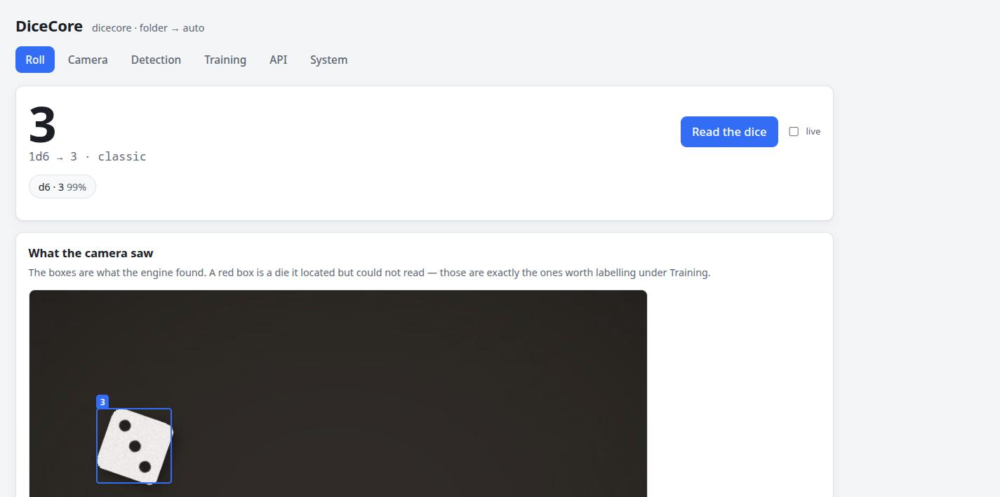
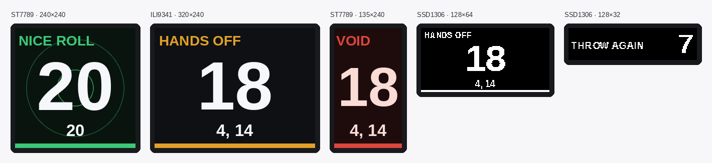
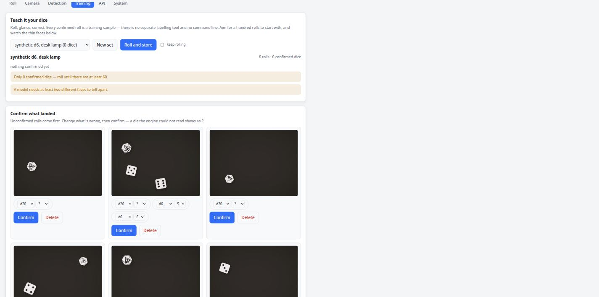

**English** · [Deutsch](README.de.md)

# DiceCore

**Reads real dice with a camera.** A Raspberry Pi looks down on the landing area of a dice
tower and turns what lands there into data: how many dice, of which kind, showing which
value, and what they add up to — as a number on a screen, as a JSON API, and as a live
event stream a bot or a game can subscribe to.

> **Status: early. Nothing has run on a real tower yet.** The pipeline works end to end on
> synthetic and simulated frames — capture, settling, pip counting, the label loop, the API
> and the web UI are all in and tested. What is missing is a trained model (that needs real
> dice in front of a real camera) and every hardware path, which is only verifiable on a Pi.
> [docs/CONCEPT.md](docs/CONCEPT.md) is the reference for where this is going;
> [docs/HARDWARE.md](docs/HARDWARE.md) is what to buy and where to put it.



## What works today

- **Reading pipped dice with no training at all.** Segment the dice against the tray, count
  the pips, report the total. On synthetic scenes it is exact; on real ones it will need the
  tray and contrast settings adjusted, which is what the **Detection** tab is for.
- **Honest failure.** Polyhedral dice are *located* and reported as unread rather than
  guessed at, because a confident wrong number is worse than "I need a model for this one".
- **Fair play.** The tray keeps being watched after the number is read. A hand reaching in
  is recorded; dice that are *not what was read* void the roll. It catches a die turned over
  after the throw, a die added or palmed, the same lucky roll reported twice, a frozen feed
  and a covered lens — and it says plainly that it is
  [tamper evidence, not tamper proof](docs/ANTI-CHEAT.md).
- **A label loop instead of a labelling tool.** Roll, glance, correct, confirm — every
  confirmed roll is a training sample, in the browser, with no command line.
- **Training from the browser**, with live loss and accuracy, exporting an ONNX model the
  engine picks up. Training needs PyTorch and so runs on a PC; the UI says so plainly rather
  than failing halfway through.
- **A game screen and a setup page.** `/` is the board you put on the television: pick a
  game, tap through a setup wizard, play. `/setup` is everything else. One service, one
  repo, two front doors.
- **Nothing is read until a game is started.** Pick from the lobby, choose how many are
  playing — the defaults are already right — and go. No keyboard needed: player count,
  names, colours and the game's own settings are all a tap.
- **Turns, holds and chips.** Kniffel is three throws with dice kept in between, so
  DiceCore counts them down, notices which dice you left on the tray, and lets a chip buy a
  fourth. Two optional GPIO buttons do the same without a browser.
- **Game modes.** The same dice, read the way the game at your table reads them: a sum, a
  count of successes, a Kniffel combination, a percentile, a roll under a target. Fourteen
  of them, from plain six-siders to a chi-square test for whether a die is loaded — and a
  *build your own* for the game that is not in the list.
- **A screen and two lamps.** ST7789, ILI9341 or SSD1306 over the tower shows the number the
  instant the dice stop, with a small animation for a natural 20; a green and a red LED plus
  a buzzer say whose turn it is without anyone reading anything. Both are optional, both run
  at once, and both are previewed in the browser before a single wire is soldered.
- **A versioned API** and a websocket stream, meant to be embedded by other projects.
- **CSI camera modules as configuration** — including Arducam IMX519 / 64MP / Owlsight /
  Pivariety, which a Pi does not auto-detect. Picking one in the UI writes the `dtoverlay`
  into `config.txt` and tells you to reboot.
- **The whole thing without hardware.** `dicecore synth` renders dice, the `folder` capture
  source plays them back, and everything above works on a laptop.



*The same renderer drives every panel and the browser preview, so the layout can be worked
out before anything is soldered.*




## Five minutes, no hardware

```bash
git clone https://github.com/TechnikWeber/DiceCore && cd DiceCore
python3 -m venv .venv && .venv/bin/pip install -e '.[vision,server,dev]'

.venv/bin/dicecore synth --count 20 --kinds d6,d20   # fake rolls to read
.venv/bin/dicecore serve                             # → http://localhost:8099/
```

`/` is the game screen, `/setup` is the workshop.

Then `curl localhost:8099/api/v1/roll`:

```json
{"dice": [{"kind": "d6", "value": 3, "confidence": 0.99, "box": {"x": 88, "y": 154, "w": 98, "h": 98}}],
 "total": 3, "count": 1, "notation": "1d6 → 3", "engine": "classic", "warnings": [],
 "verdict": "clean", "usable": true, "stale": false}
```

The number arrives about a fifth of a second after the dice stop — the fair-play watch runs
behind it and the verdict lands on `/api/v1/state` and the websocket a couple of seconds
later. `?verify=1` waits for it instead.

## One line, on a Pi or on a desktop

```bash
curl -fsSL https://raw.githubusercontent.com/TechnikWeber/DiceCore/main/provisioning/bootstrap.sh | bash
```

It works out which machine it is on and installs what that machine can actually use: the
camera stack and a systemd service on a Pi, PyTorch and no service on a desktop, and on an
ARMv6 Pi Zero the bare package plus a note to point it at another machine. Force it with
`| bash -s -- --role desk` or `--role pi`.

By hand instead:

```bash
sudo apt install rpicam-apps python3-picamera2
git clone https://github.com/TechnikWeber/DiceCore && cd DiceCore
python3 -m venv --system-site-packages .venv
.venv/bin/pip install -e '.[vision,server]'
.venv/bin/dicecore doctor      # what this Pi can and cannot do
.venv/bin/dicecore serve
```

`doctor` is worth reading before anything else — on a **Pi Zero v1 or Pi 3 (ARMv6)** there
is no OpenCV and no onnxruntime, and it will say so. That is not a dead end: install with no
extras, set `engine.mode=remote`, and point it at a PC or a Pi 5 also running DiceCore. The
Pi captures, the other machine reads, and the API answers identically either way.

## How it fits together

```
Capture ────────────► Engine ──────────► Outputs
picamera2 / rpicam    classic (pips)     HTTP JSON  /api/v1/roll
v4l2 / folder / push  model (ONNX)       WebSocket  /api/v1/events
                      remote (another    Web UI
   │                   DiceCore node)    your bot, your game
   └──► Dataset ──► Training ──► model.onnx ──┘
```

Every box is swappable through configuration, and every one of them has an implementation
that works without hardware. See [docs/CONCEPT.md](docs/CONCEPT.md).

## Using it from another project

That is the entire point — see [docs/API.md](docs/API.md).

```python
import requests
roll = requests.get("http://dicecore.local:8099/api/v1/roll", timeout=15).json()
if roll["usable"]:                               # false only when the tray was interfered with
    print(roll["notation"], "=", roll["total"])  # 1d6+1d20 → 4, 14 = 18

# …or let a game mode read it, without changing anybody else's
pool = requests.get(".../api/v1/roll?mode=pool").json()
print(pool["reading"]["headline"])               # 3 successes
```

A die that could not be read has `"value": 0` and prints as `?`. Never add it up.

## Documentation

| | |
|---|---|
| [docs/CONCEPT.md](docs/CONCEPT.md) | What this is meant to become, and why it is built this way |
| [docs/HARDWARE.md](docs/HARDWARE.md) | Which Pi, which camera, where to mount it, how to light it |
| [docs/API.md](docs/API.md) | The contract other projects depend on |
| [docs/TRAINING.md](docs/TRAINING.md) | Teaching it your own dice |
| [docs/ANTI-CHEAT.md](docs/ANTI-CHEAT.md) | What the fair-play watch catches, and what it cannot |
| [docs/PLAYING.md](docs/PLAYING.md) | The game screen, turns, chips and the two buttons |
| [docs/GAME-MODES.md](docs/GAME-MODES.md) | The modes, what each one scores, and how to add another |
| [docs/DISPLAYS.md](docs/DISPLAYS.md) | The screen, the lamps and the buzzer — panels, pins, wiring |

## Commands

```bash
dicecore serve                  # API + setup page
dicecore roll                   # read once, print the result
dicecore doctor                 # what this machine can do, and what the camera says
dicecore synth [folder]         # synthetic rolls for the simulator
dicecore sets                   # dataset sets and whether they are trainable
dicecore train <set>            # train a model (needs PyTorch)
dicecore camera-module list     # CSI modules; `camera-module imx519` writes config.txt
```

## Development

```bash
.venv/bin/pytest                # the whole suite, no hardware needed
.venv/bin/ruff check src tests
```

The suite renders its own dice, so recognition is actually tested rather than merely
imported. See [CLAUDE.md](CLAUDE.md) for the conventions before changing anything.

## TODO

- [ ] Run it on a real tower with a real camera; correct [docs/HARDWARE.md](docs/HARDWARE.md)
- [ ] Collect the first real dataset and train the first model
- [ ] Top-face selection and 6/9 handling verified on real d20s
- [ ] Overlapping and cocked dice: detect and report rather than mis-read
- [ ] Fair-play thresholds (`hand_area_frac`, `motion_threshold`) checked against real hands
- [ ] A real ST7789 and a real SSD1306 on a real Pi; the drivers are written but untested
- [ ] A reference Discord bot, in its own repo, consuming this API
- [ ] Provisioning: installer, systemd unit, and the IMX519 tuning file shipped

## Licence

CC BY-NC-ND 4.0 with an additional no-military restriction — see [LICENSE](LICENSE).
