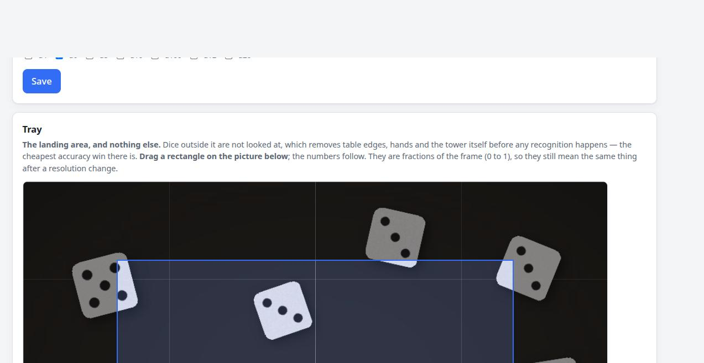

**English** · [Deutsch](HARDWARE.de.md)

# Hardware

What to put where, and what each choice costs you. Nothing here has been built yet — this
is the plan the software is written against, and it will be corrected as real parts arrive.

## The short version

| Part | Pick | Why |
|---|---|---|
| Computer | **Pi 4 (2 GB+) or Pi 5** | Runs a trained model locally in a few ms |
| | Pi Zero 2 W | Works, but read on a stronger machine (`engine.mode=remote`) |
| | Pi 3 / Pi Zero v1 | Capture only — see *ARMv6 and ARMv7* below |
| Camera | **Camera Module 3 (IMX708)** | Autofocus, auto-detected, 12 MP is plenty |
| | Arducam 16MP IMX519 | Autofocus, sharper, needs a `dtoverlay` and the shipped tuning file |
| | HQ Camera (IMX477) + 6 mm lens | When the camera has to sit far from the tray |
| | Any USB webcam | `capture.source=v4l2`, fine for a first setup |
| Light | Two small LEDs at a low angle | Kills the specular blob that hides pips |
| Mount | Camera looking **straight down** at the tray | Every numeral stays readable |

## Which Raspberry Pi

The interesting constraint is not speed, it is what wheels exist for the architecture.

| Model | Arch | numpy/OpenCV | onnxruntime | PyTorch | What it can do |
|---|---|---|---|---|---|
| Pi 5, Pi 4 | arm64 | yes | yes | yes (slow) | Everything, model included |
| Pi 3, Zero 2 W (64-bit OS) | arm64 | yes | yes | painful | Classic + model; train elsewhere |
| Pi 3, Zero 2 W (32-bit OS) | armv7 | yes | yes | no | Classic + model; train elsewhere |
| **Pi Zero v1, Pi 1** | **armv6** | **no**¹ | **no** | no | **Capture only** |

¹ piwheels has armv6 builds of numpy, but not of a modern OpenCV. Assume no vision stack.

**This is why the split deployment exists.** On an ARMv6 Zero, install DiceCore with no
extras at all, set `capture.source=rpicam` and `engine.mode=remote`, and point
`engine.remote_url` at a Pi 5 or a PC also running DiceCore. The Zero captures a JPEG
straight from `rpicam-still` — no numpy, no OpenCV — and posts it to `/api/v1/detect`. The
answer is identical to a local read, so nothing that consumes the API can tell.

The other direction works too: run the whole of DiceCore on a PC and give the Pi nothing but
a capture script that POSTs to `/api/v1/frame`.

## Cameras

DiceCore treats "which sensor" as configuration, because on a Pi it genuinely is. The four
official modules are found by `camera_auto_detect=1`. Everything else needs
`camera_auto_detect=0` plus an explicit `dtoverlay=` in `/boot/firmware/config.txt` and a
reboot — the **Camera → CSI camera module** panel writes that for you and says so.

| Module | Overlay | Notes |
|---|---|---|
| Camera Module 1/2/3, HQ | *(auto)* | OV5647, IMX219, IMX708, IMX477 |
| **Arducam 16MP IMX519** | `imx519` | Autofocus. **Needs the shipped tuning file** |
| Arducam 64MP Hawkeye | `arducam-64mp` | Autofocus |
| Arducam 64MP Owlsight | `ov64a40` | Autofocus |
| Arducam Pivariety | `arducam-pivariety` | Answers on I²C 0x0c |
| Anything else | *(you type it)* | Checked against `/boot/firmware/overlays` first |

### The IMX519 autofocus trap

Raspberry Pi's own `imx519.json` tuning file contains no `rpi.af` algorithm, so libcamera
answers every focus request with *no AF algorithm available* and the lens stays where it
rests. It does not look like a broken focus — it looks like a soft lens. Select the module
in the UI (which sets `capture.tuning_file` to the shipped `imx519-af.json`) and pick a
focus mode. Over a dice tray, prefer `manual` at a fixed dioptre: `continuous` hunts every
time a die moves, and hunting is exactly what you do not want mid-roll.

### If no camera is found

The **Camera** tab says which of these it is, but in short:

1. Ribbon cable: contacts towards the HDMI side, in the **CAM** port, not DISPLAY.
2. `rpicam-hello --list-cameras` lists nothing → wrong module selected, or auto-detect is on
   for a sensor it does not know.
3. `sudo i2cdetect -y 10` is silent too (needs `dtparam=i2c_vc=on`) → it is the cable.

## Mounting over the tower

- **Straight down.** Any tilt turns the top face of a d20 into a trapezoid and makes the
  surrounding faces bigger than the one that matters.
- **Far enough that the whole tray fits with room to spare**, then crop with the tray
  rectangle in the UI. A die half out of frame is a wrong number, not a missing one.
- **Fixed.** Everything the engine learns about your setup — the tray, the die size, the
  model — assumes the camera does not move. Screw it down; do not clamp it to the tower's
  own wall, which flexes with every throw.
- The landing area should be **matte and plain**, and should contrast with the dice: dark
  tray for white dice. Felt beats acrylic; acrylic reflects the lamp straight into the lens.
- Roughly 25–35 cm from tray to lens with a standard module frames a 15 × 15 cm tray nicely.

## Light

Two small LED strips or lamps at a **low angle from opposite sides**. Overhead light sits a
specular highlight in the middle of every die, right where the pips are, and a ring light
around the lens does the same thing more expensively. Low and from two sides also keeps the
shadows short, which matters because a long shadow reads as part of the die's outline.

Whatever you choose, keep it **constant**. A model trained under a desk lamp and used under
daylight is a model trained on the desk lamp.

## Colours

DiceCore can name each die's colour as well as its face — red, blue, white, black and the
rest — under **Detection → Classic engine**. It is off by default because it costs a little
work per die and most games do not care; turn it on for the games that are *about* the
colours, or to tell one player's dice from another's on a shared tray.

It wants what everything else here wants: even light and a tray the dice do not match. A
black die on a black tray is invisible to a camera and to a person, and no engine can be
blamed for that.

## Calibrating the tray

Once, in the **Detection** tab:

1. **Drag a rectangle** over the picture under *Detection → Tray*, covering the landing
   area and nothing else. The four fractions follow; there is nothing to type. Everything
   outside the rectangle is dimmed, so what the engine will ignore is visible rather than
   implied.

   
2. Measure one die with a ruler (a standard d6 is 16 mm) and read its pixel width off a
   captured frame. `mm_per_px = 16 / pixels`. This lets the engine use physical size as a
   hint when telling die kinds apart.

Both are fractions and ratios, so they survive a resolution change.
