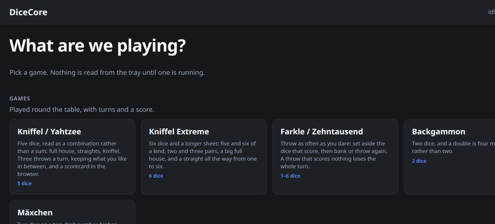
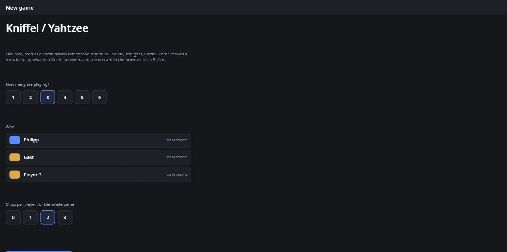
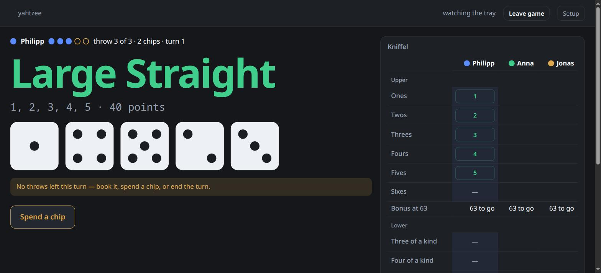

# Playing

Two front doors, one service.

| | |
|---|---|
| **`/`** | The **game screen**. Put it on the television at the table. |
| **`/setup`** | Everything else — camera, detection, fair play, panel, training. |

The game screen is at the root and the setup page is not, on purpose: the page you look at
all evening should not be one tab away behind six you never touch.

## Four screens, one at a time

```
lobby ──► setup ──► game ──► result
  ▲                            │
  └────────────────────────────┘
```

**Nothing reads the tray until a game is running.** The first version of this screen opened
straight into whatever mode happened to be configured and started capturing, which meant a
player was watching numbers change with no idea what was going on. A game is now something
you *start*, and the camera idles until you do.

### The lobby

Every mode as a tile, in three groups: **Games** (turns, players, a score), **Just show the
numbers** (DiceCore reads and reports, nothing to play), and **Tools** (the fairness test
and the build-your-own). Tap one.

### The setup wizard

Everything by tapping, because a table does not have a keyboard:

- **How many are playing** — 1 to 6, and **2 is already selected**.
- **Who** — *Player 1*, *Player 2* … already filled in, each with its own colour. Tap a
  colour to swap it for one nobody else is using; tap a name to rename it if you feel like
  it. Neither is necessary.
- **The game's own settings**, and only the ones a table actually decides: chips for
  Kniffel, the target and the entry threshold for Farkle, the success threshold for a pool.
  Every one is a row of buttons with a sensible answer already chosen.

Start works on the first tap. The wizard remembers the names and colours from the last game
of that kind, so the second evening is one tap shorter than the first.

### The game, and the result

Colours run through everything — the turn marker, the scorecard columns, the log — so nobody
has to remember which player they are. When the last box is booked or somebody passes the
target, the result screen shows the standings and offers **Play again** with the same
players, or a different game.







## What it shows

- **The headline**, as the mode read it: `18`, `Full house`, `3 successes`.
- **The dice**, drawn — a six-sider as pips, everything else as its number. Tap one to hold
  it in a game where holding is part of the rules.
- **The throw counter**: filled dots for throws used, hollow for throws left, amber for
  chips. `throw 2 of 3` in words next to it.
- **The scorecard**, for the games that have one. The current player's open categories show
  what they would score right now; tap one to book it.
- **The last turns**, down the side.

## Turns

Most games are one throw and done. Kniffel and Farkle are not: a turn there is three throws,
keeping what you like in between, and the turn ends when you book something.

**Holds are observed, not enforced.** DiceCore notices which dice did not move between two
throws and shows those as kept — that is the only signal a camera has. If it guesses wrong,
tap the die. Nothing depends on the guess being right: what gets scored is simply what is on
the tray, so a mis-detected hold costs you nothing but a wrong label for a moment.

A throw only counts when the dice actually changed. Looking at the same settled dice again —
which the camera does several times a second — is not a throw, and does not burn one.

### Chips

A chip buys one more throw when the ordinary ones are gone. Set how many each player gets
in the setup wizard or under **Detection → Game mode** — up to four, and zero by default.

Chips are a **house rule**: the Kniffel in the box is three throws a turn and nothing else.
Plenty of tables play with a handful of tokens for a fourth throw, which is what this is
for, and four is the cap because that is the most anyone seems to hand out.

**Chips are per game, not per turn.** Three chips means three for the whole evening, so
spending one is a decision — refilling them every turn would take the decision away and
leave only the button. A new game hands them back.

A chip **cannot be spent while ordinary throws remain**. Spending one by fumbling a button
is exactly the kind of mistake a game should not allow. In a game with no throw limit at
all, like Farkle, a chip buys nothing and says so.

## Surviving a restart

A game in progress is written to `game.json` in the state directory after every move and
read back when the service starts. An evening of Kniffel is an hour of somebody's life and
a Pi that loses power should not cost it. A file that cannot be read means a lost game —
never a service that will not start.

## The two buttons

The browser is not always where your hands are. Two optional GPIO buttons do the same two
things:

| Button | Default pin (BCM) | Does |
|---|---|---|
| Chip | *(off)* | Spend a chip — one more throw |
| End turn | *(off)* | In the lobby: start the configured game. In a game: end the turn |

**Ending a turn only means something where "done" is the whole story** — Backgammon,
Mäxchen, and anything else where you move your own pieces and DiceCore has nothing to write
down. On a scorecard there is always something else to say (*which box*), so the button
refuses there and says what it is waiting for. It used to end the turn anyway, which cost
the player their throw: the worst thing a physical button can do.

In the lobby it starts the configured game, which is the keyboard-free path from standing
up to throwing: press one button, play.

Wire each between the pin and ground and leave **Buttons use the internal pull-up** on;
that is the whole circuit. Set the pins under **Setup → Screen & lamps**, and `-1` for a
button you do not want. They call exactly the same endpoints the browser buttons do, so a
table can use either, both, or neither.

## The panel during a turn

The little screen over the tower carries the turn as well: `2/3` in the corner, a dot for
each chip, and a caption that changes with what you may do next —

| | |
|---|---|
| **THROW AGAIN** | throws left |
| **CHIP OR BOOK** | throws gone, chips in hand |
| **TURN OVER** | nothing left to do but book |

The green lamp means the same thing it always did: it is your turn to throw.

## The boards

Two games have a board of their own, and they are deliberately opposite shapes — which is
what shows the turn machine is a machine rather than a Kniffel-shaped hole.

### Kniffel, and Kniffel Extreme

Three throws, dice kept in between, then a category. Every open box shows what it would
score right now; tapping one books it and hands the tower on. Crossing a box out for nothing
is a real move and has to be confirmed.

**Kniffel Extreme** is the same shape with six dice and a longer sheet: five and six of a
kind, two pairs and three pairs, a big full house of three and three, and a straight running
all the way from one to six. The upper bonus asks for 84 rather than 63 — with six dice you
expect one of every face in a throw, so three of one is no longer the effort the standard
bonus rewards — and pays 50.

> The extended sheet is a **defined house sheet, not a transcription of a boxed product**.
> If the version on your table says otherwise, the numbers are a table in
> `src/dicecore/play/kniffel.py` and changing them is a one-line job.

| | Kniffel | Kniffel Extreme |
|---|---|---|
| Dice | 5 | 6 |
| Boxes | 13 | 18 |
| Bonus | 35 at 63 | 50 at 84 |
| Best box | Kniffel, 50 | Six of a kind, 100 |

### Farkle

The opposite of a fixed number of throws: you throw as often as you dare. Set aside the
dice that score — they leave the tray, so the next throw genuinely has fewer dice in it,
which the camera sees directly — then either bank what the turn has earned or throw again.

A throw with nothing scoring in it is a **Farkle** and the whole turn is lost. Set aside all
six and the dice are *hot*: the whole hand comes back and you keep going.

Every die you set aside has to score. A selection with a dead die in it is refused rather
than scored, because carrying one along would quietly cost you a throw's worth of dice.

House rules, as implemented: single 1 is 100 and single 5 is 50; three of a kind is 100×
the face except three ones at 1000; four, five and six of a kind double, quadruple and
octuple that; a straight or three pairs is 1500; you need 500 in one turn to get on the
board; first to 10 000 wins. The target and the entry threshold are settings.

## Playing with people who are not in the room

**Setup → Camera → Live view** offers the tray at `/api/v1/stream.mjpg`, and the game screen
grows a **Camera** button that shows it in the corner. The people you are playing with can
watch the dice land, which is the only thing that convinces anybody at a distance.

Two properties worth knowing. It **never opens the camera a second time**: what it sends is
whatever the reader last captured, so during a game it runs at the pace the dice are being
read and cannot compete with the reading for the device. And it is **off until you switch it
on** — a continuous view of whatever the camera can see is a different proposition from the
single still the setup page asks for, and it is the room's decision rather than a default.

It is not proof of anything on its own; see [ANTI-CHEAT.md](ANTI-CHEAT.md) for what is and
is not demonstrable. But a number that appears on a screen while everyone watches the dice
land is about as convincing as dice get.

## Several players

Chosen in the wizard, and that is the only place they need to be chosen. The tower passes
round by itself: booking a category ends the turn and the next name comes up. Changing the
players starts a new game, because handing player three's card to a different player three
would be worse than losing the scores.

One player is a solo game, which is the right shape for practising, for a fairness test, or
for a machine that just shows numbers. The names can also be set under **Setup → Players and
turns** if you would rather type them once and forget them.

## Your own screen instead

Everything the play screen does is `/api/v1/game` plus five POSTs, all part of the versioned
API — because a play screen is exactly the sort of thing someone will want to write their
own version of, on a tablet, on a TV, in a language this project does not use.

```bash
curl -X POST .../api/v1/game/start \
     -d '{"mode": "yahtzee", "players": ["Ada", "Bob"], "params": {"chips": 2}}'
curl http://dicecore.local:8099/api/v1/game            # turn, cards, options, log
curl -X POST .../api/v1/game/chip                      # one more throw
curl -X POST .../api/v1/game/hold  -d '{"index": 2}'   # correct a hold
curl -X POST .../api/v1/game/book  -d '{"category": "full_house"}'
curl -X POST .../api/v1/game/next                      # end the turn
curl -X POST .../api/v1/game/reset -d '{"players": ["A", "B"]}'
curl -X POST .../api/v1/game/stop                      # back to the lobby; reading stops
```

The websocket at `/api/v1/events` carries the same game state alongside every roll, so a
screen never has to poll.

## Reading without playing

None of this is compulsory. A consumer that only wants numbers keeps using `/api/v1/roll`
and ignores the game entirely — and can even ask for a different mode with `?mode=`, which
changes nothing about the game running at the table. The D&D bot and the scoreboard at the
table can be looking at the same tray, disagreeing about what it means, and both be right.
